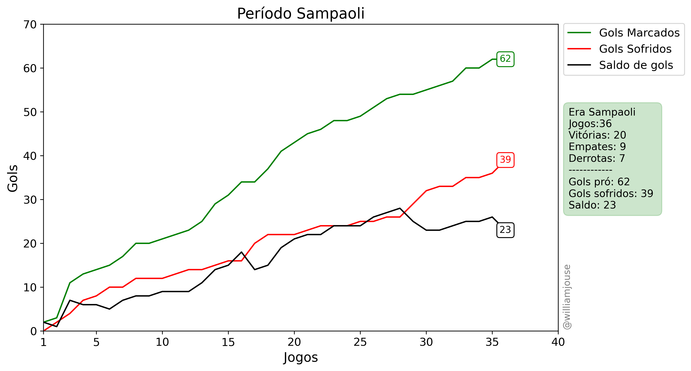

## Jogos do Flamengo disputados em 2023

Tabelas com informações sobre os jogos do Flamengo no ano de 2023. A tabela [matches_FLA2023.csv](https://github.com/williamjouse/jogos-Flamengo-2023/blob/main/data/matches_FLA2023.csv)
contém as seguintes colunas:

- id_match: ID do jogo
- home_team: Time mandante
- away_team: Time visitante
- home_score: Gols marcado pelo mandante
- away_score: Gols marcado pelo visitante
- tournament: Torneio ou competição e rodada
- kick-off: Data e hora da partida
- stadium: Estádio da partida


Na segunda tabela de nome [goal_scorers.csv](https://github.com/williamjouse/jogos-Flamengo-2023/blob/main/data/goal_scorers.csv) contém as seguites colunas:

- id_match: ID do jogo
- gols: Jogadores que fizem gols na partida
- assist: Assistência para o gol


No arquivo [matches_FLA2023.xlsx](https://github.com/williamjouse/jogos-Flamengo-2023/blob/main/data/matches_FLA2023.xlsx) contém a junção das 2 tabelas em um único lugar.


### Algumas estatísticas

| Jogador           |   Gols |   Assistências |
|:------------------|-------:|---------------:|
| Pedro             |     27 |              4 |
| Gabi              |     19 |              3 |
| Ayrton Lucas      |      6 |              5 |
| Arrascaeta        |      6 |             12 |
| Bruno Henrique    |      5 |              1 |
| Everton Cebolinha |      4 |              8 |
| Léo Pereira       |      4 |              1 |
| Victor Hugo       |      3 |              1 |
| Gerson            |      3 |              9 |
| Matheus França    |      3 |              0 |
| Thiago Maia       |      3 |              0 |
| Fabrício Bruno    |      3 |              0 |
| Matheus Gonçalves |      2 |              0 |
| Everton Ribeiro   |      2 |              5 |
| Eric Pulgar       |      2 |              2 |


```
Jogos: 54
Vitórias: 30
Empates: 10
Derrotas: 14 
Gols pro: 98
Gols contra: 60
Saldo de gols: +38
Gols/jogo: 1.81
Gols sofridos/jogo: 1.11
Jogos em que marcou: 46
Jogos em que sofreu gol: 33 
Aproveitamento: 61.73%
Aproveitamento pontos: 100/162
```


----





### Referências e Dados

- [Sofascore](https://www.sofascore.com/)
- [O Goal](https://www.ogol.com.br)
- [ge](https://ge.globo.com/)